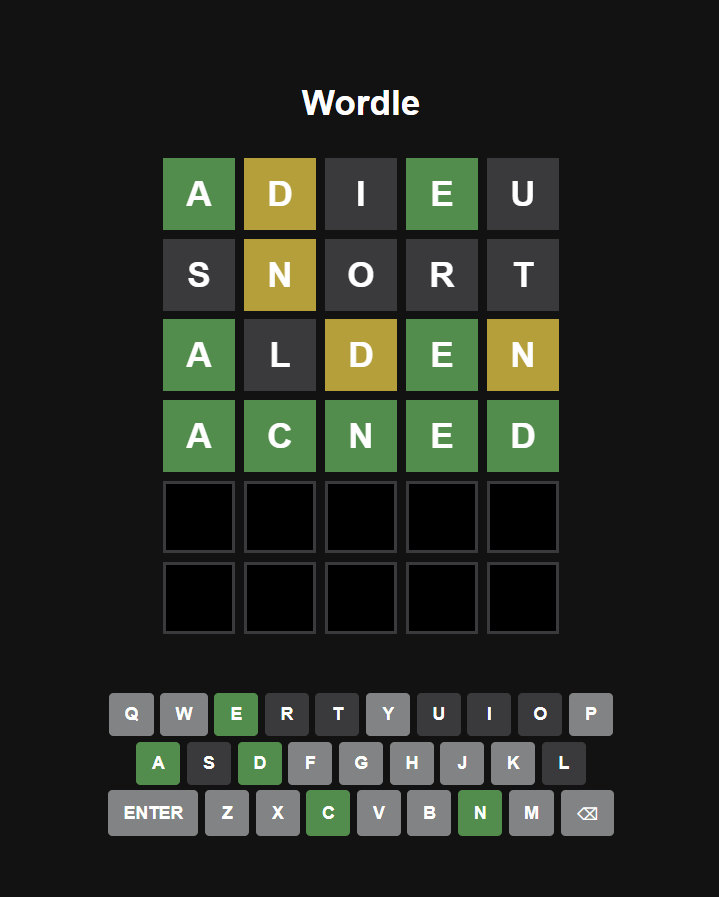

# Wordle on React

A simple Wordle-style word guessing game built with React and Vite. Type or tap letters to guess the 5-letter word in 6 tries or less. Visual feedback shows correct, present, or absent letters.



---

## 🚀 Features

- 🎮 Classic 6x5 word grid
- 🎹 Virtual keyboard with real-time status
- ✅ Word validation with curated dictionary (sourced from Wordle)
- 🟩 Flip animations for tile reveals
- 📱 Mobile responsive design
- 🔁 Random solution each game

---

## 🛠️ Setup

```bash
# 1. Clone the repo
git clone https://github.com/maximus-teo/wordle.git
cd wordle

# 2. Install dependencies
npm install

# 3. Start the development server
npm run dev
```